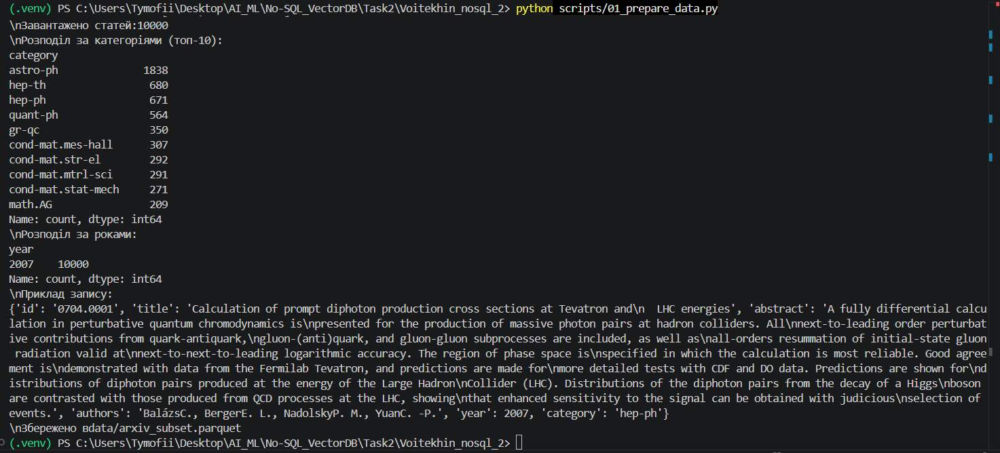
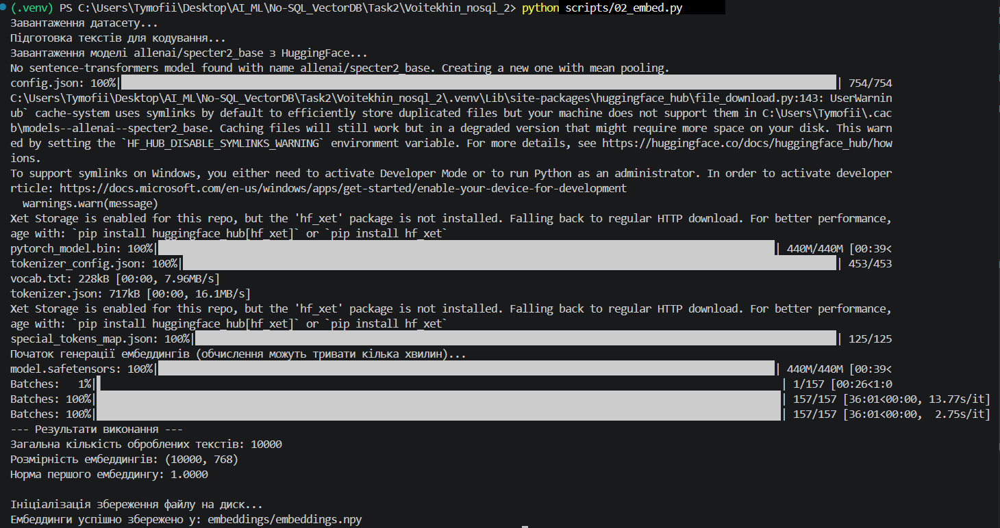
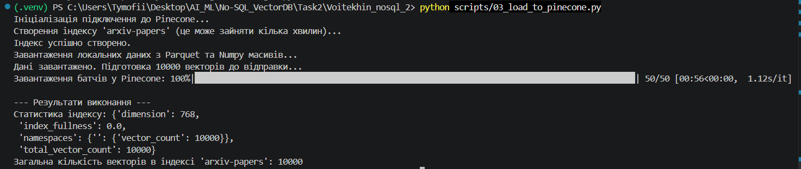

## Частина 1 — Підготовка даних і вибір інструментів

### 1.2. Вибір інструментів (Теоретичні питання)

**1. Чим Pinecone відрізняється від Qdrant і Chroma за моделлю розгортання, ліцензією і продуктивністю? У якому сценарії ви б обрали кожен із них?**
Pinecone — це повністю керований хмарний сервіс (SaaS) із закритим вихідним кодом. Його головна перевага — відсутність необхідності налаштовувати інфраструктуру (zero-ops), висока швидкість розгортання та автоматичне масштабування, проте він не має можливості локального встановлення. Qdrant — написаний на Rust, має відкритий вихідний код (open-source), пропонує як хмарне, так і локальне (self-hosted) розгортання. Він надзвичайно швидко працює зі складними фільтрами метаданих. Chroma — також open-source, зазвичай використовується як локальна вбудована база даних (embedded, подібно до SQLite) і працює безпосередньо в пам'яті комп'ютера. 
*Сценарії:* **Pinecone** я б обрав для швидкого запуску enterprise-проєкту без виділеної команди підтримки серверів; **Qdrant** — для масштабних систем, де потрібен повний контроль над даними та серверами; **Chroma** — для швидкого прототипування, локального тестування RAG-систем або невеликих проєктів на власному ПК.

**2. Чому для задачі пошуку по науковим текстам обрана модель specter2_base, а не універсальна all-MiniLM-L6-v2?**
Універсальна модель `all-MiniLM-L6-v2` навчалася на текстах загального призначення (новини, Вікіпедія, Reddit) і добре розуміє побутову мову, але їй бракує словникового запасу для складної наукової термінології. Натомість `specter2_base` розроблена інститутом AllenAI спеціально для наукових статей. Згідно з описом моделі на HuggingFace, вона тренувалася на графах цитувань: *"SPECTER2 has been trained on over 6M triplets of scientific paper citations"*. Це означає, що модель розуміє контекст і зв'язки між статтями, навіть якщо вони написані різними словами. Вона ідеально підходить для задач *"document-level retrieval, classification, or clustering of scientific papers"*.

**3. Що написано у картці моделі про рекомендовану метрику схожості? Чому це важливо при створенні індексу?**
Розробники моделей на базі Sentence Transformers (включно зі `specter2`) зазвичай використовують косинусну відстань під час тренування. Однак, на практиці рекомендується застосовувати L2-нормалізацію до отриманих векторів. Після нормалізації найбільш ефективною метрикою стає скалярний добуток (Dot Product). Вибір правильної метрики при створенні індексу Pinecone є критично важливим, оскільки це безпосередньо впливає на математичну точність ранжування результатів та швидкість обробки запитів пошуковою системою.

---

### 1.3 Теоретичне питання до скрипта 02_embed.py
**Поясніть, чому при використанні нормалізованих ембеддингів (одиничної довжини) косинусна схожість (cosine similarity) еквівалентна скалярному добутку (dot product)?**
Математично косинусна схожість обчислюється за формулою:
$$\cos(\theta) = \frac{\mathbf{A} \cdot \mathbf{B}}{\|\mathbf{A}\|\|\mathbf{B}\|}$$
де $\mathbf{A} \cdot \mathbf{B}$ — скалярний добуток векторів, а $\|\mathbf{A}\|$ та $\|\mathbf{B}\|$ — їхні довжини (норми). Коли ми застосовуємо L2-нормалізацію під час створення ембеддингів (`normalize_embeddings=True`), ми примусово робимо довжину кожного вектора рівною одиниці, тобто $\|\mathbf{A}\| = 1$ та $\|\mathbf{B}\| = 1$.
У такому разі знаменник формули зникає (дорівнює $1 \times 1 = 1$), і формула скорочується до:
$$\cos(\theta) = \mathbf{A} \cdot \mathbf{B}$$
Отже, скалярний добуток нормалізованих векторів дає ідентичний результат ранжування, але обчислюється значно швидше базою даних, оскільки економить процесорні ресурси на обчисленні коренів та діленні.

---

## Результати виконання скриптів (Виводи з терміналу)

### Крок 1. Підготовка даних (01_prepare_data.py)


### Крок 2. Отримання ембеддингів (02_embed.py)


## Частина 2 — Завантаження даних і метадані

### Крок 3. Завантаження у Pinecone (03_load_to_pinecone.py)


## Частина 3 — Пошукові запити

### Теоретичні питання до скрипта 04_search.py

**1. Чи збігаються топ-5 для cosine і dot product і чому?**
Так, результати (список документів та їхній порядок) збігаються абсолютно. Оскільки під час генерації ембеддингів було застосовано L2-нормалізацію (`normalize_embeddings=True`), довжина кожного вектора дорівнює $1$. За формулою косинусної схожості $\cos(\theta) = \frac{\mathbf{A} \cdot \mathbf{B}}{\|\mathbf{A}\|\|\mathbf{B}\|}$, знаменник перетворюється на одиницю, і функція зводиться до $\cos(\theta) = \mathbf{A} \cdot \mathbf{B}$. Тому скалярний добуток для нормалізованих векторів є математичним еквівалентом косинусної відстані.

**2. Чи відрізняються результати для L2 і чому?**
Сам набір документів у топ-5 та їхнє відносне ранжування не відрізнятимуться (вони будуть ідентичними до результатів dot product / cosine), але значення самої метрики будуть іншими. L2-відстань (Евклідова відстань) між двома нормалізованими векторами пов'язана зі скалярним добутком через рівняння: $d^2(\mathbf{A},\mathbf{B}) = \|\mathbf{A} - \mathbf{B}\|^2 = \|\mathbf{A}\|^2 + \|\mathbf{B}\|^2 - 2(\mathbf{A} \cdot \mathbf{B}) = 2 - 2(\mathbf{A} \cdot \mathbf{B})$. Звідси видно, що чим більший скалярний добуток (вища схожість), тим менша L2-відстань. Оскільки при пошуку за L2 ми шукаємо мінімальне значення (відстань), а при dot product — максимальне (схожість), результати ранжування збігаються.

**3. Що сталося б, якби ембеддинги не були нормалізовані?**
Якби вектори мали різну довжину, топ-5 для `cosine` та `dot_product` суттєво відрізнялися б. Метрика `dot_product` почала б віддавати перевагу векторам з більшою "магнітудою" (довжиною), незалежно від кута між ними. Це призвело б до зміщення результатів у бік документів з аномальними характеристиками розподілу токенів, руйнуючи семантичну точність пошуку. `Cosine similarity` продовжувала б вимірювати лише кут, ігноруючи довжину.

### Крок 4. Пошук та порівняння метрик (04_search.py)
**Вивід консолі:**
```text
Ініціалізація інфраструктури...
Використовується обчислювальний пристрій: CPU

Запит: 'teaching machines to recognize objects in pictures'

Виконання запиту до Pinecone (Чистий семантичний пошук)...
==================================================
3. ЧИСТИЙ СЕМАНТИЧНИЙ ПОШУК
==================================================
[1] Score: 0.8288 | ID: 0704.0379
Назва: Capturing knots in polymers
Категорія: cond-mat.soft | Рік: 2007.0

[2] Score: 0.8263 | ID: 0704.3351
Назва: Symbolic sensors : one solution to the numerical-symbolic interface
Категорія: physics.ins-det | Рік: 2007.0

[3] Score: 0.8256 | ID: 0705.0113
Назва: The Mathematics
Категорія: math.HO | Рік: 2007.0

[4] Score: 0.8170 | ID: 0704.0611
Назва: Modeling the field of laser welding melt pool by RBFNN
Категорія: physics.comp-ph | Рік: 2007.0

[5] Score: 0.8146 | ID: 0704.2241
Назва: Why should anyone care about computing with anyons?
Категорія: quant-ph | Рік: 2007.0

Виконання запитів до Pinecone (З фільтрацією метаданих)...
==================================================
4A. ФІЛЬТР: RL, >=2019, cs.LG
==================================================
(Немає результатів)

==================================================
4B. ФІЛЬТР: RL, <2015, Будь-яка категорія
==================================================
[1] Score: 0.8445 | ID: 0706.0280
Назва: Multi-Agent Modeling Using Intelligent Agents in the Game of Lerpa
Категорія: cs.MA | Рік: 2007.0

[2] Score: 0.8194 | ID: 0704.2536
Назва: Introduction to Phase Transitions in Random Optimization Problems
Категорія: cond-mat.stat-mech | Рік: 2007.0
... (додаткові результати з фізики)

Завантаження локальних ембеддингів для аналізу метрик...
==================================================
5. ПОРІВНЯННЯ ЛОКАЛЬНИХ МЕТРИК
==================================================
Топ-5 індексів (Dot Product):   [ 378 3350 4115  610 3181]
Топ-5 індексів (Cosine Sim):    [ 378 3350 4115  610 3181]
Топ-5 індексів (L2 Distance):   [ 378 3350 4115  610 3181]

Висновок: Індекси топ-5 документів для всіх трьох метрик збігаються: True 

```

## Частина 4 — Chunking

### Теоретичні питання до скрипта 05_chunking.py

**1. Яка стратегія дає більш осмислені чанки?**
Semantic chunking (семантичне розбиття) генерує значно якісніші та більш осмислені чанки. Оскільки розбиття відбувається суворо по межах речень, кожен фрагмент містить логічно завершені думки. Модель ембеддингів (яка тренувалася на цілих реченнях і абзацах) здатна набагато точніше відобразити семантику такого тексту у векторному просторі.

**2. Чи є випадки розрізаних речень і як це впливає на ембеддинги?**
Так, у стратегії Fixed-size розрізання речень навпіл є неминучим. Наприклад, речення *"Алгоритм використовує глибокі нейронні мережі"* може розірватися на *"Алгоритм використовує глибокі"* (кінець чанка 1) та *"нейронні мережі"* (початок чанка 2). Це критично погіршує якість ембеддингів: модель отримує обірваний контекст без підмета або присудка, що призводить до генерації "шумного" вектора. Такий вектор матиме низький скалярний добуток із релевантними запитами.

**3. Як розмір overlap впливає на кількість чанків і покриття тексту?**
Overlap (перекриття) — це дублювання частини тексту між сусідніми чанками. Збільшення розміру overlap призводить до експоненційного зростання загальної кількості чанків, оскільки кожен наступний чанк "просувається" вперед на меншу кількість нових слів. Це збільшує витрати на зберігання у векторній базі (Pinecone) та обчислення. Однак, правильний overlap (зазвичай 10-20%) забезпечує 100% покриття зв'язків між словами, гарантуючи, що жоден важливий термін не опиниться розірваним на межі розбиття.

### Крок 5. Chunking та пошук по фрагментах (05_chunking.py)

**Вивід консолі:**
```text
Ініціалізація інфраструктури...
Використовується обчислювальний пристрій: CPU
Відібрано 30 статей. Середня довжина анотації: 308 слів.
Створення індексу arxiv-chunks-fixed...
Індекс arxiv-chunks-fixed готовий.
Створення індексу arxiv-chunks-semantic...
Індекс arxiv-chunks-semantic готовий.

Генерація чанків для індексу: arxiv-chunks-fixed...
Завантаження 241 векторів у Pinecone...
Завантаження завершено. Векторів в індексі: 241

Генерація чанків для індексу: arxiv-chunks-semantic...
Завантаження 249 векторів у Pinecone...
Завантаження завершено. Векторів в індексі: 249

Запит: 'quantum state optimization and entanglement'

--------------------------------------------------
Пошук по чанках: FIXED-SIZE
--------------------------------------------------
[1] Score: 0.7757 | Article: Conjectures on exact solution of three - dimensional (3D) simple orthorhombic Ising lattices
    Chunk text: the eigenvectors, are proposed to serve as a boundary condition to deal with the topologic problem of the 3D Ising model. The partition function of the 3D simple orthorhombic Ising model is evaluated by spinor analysis, by employing these conjectures. Based on the validity of the conjectures, the critical temperature...

[2] Score: 0.7751 | Article: (Co)cyclic (co)homology of bialgebroids: An approach via (co)monads
    Chunk text: with coefficients, by tracing it back to the group case. In particular, we obtain explicit expressions for ordinary Hochschild and cyclic homology of a groupoid....

[3] Score: 0.7726 | Article: Geochemistry of U and Th and its Influence on the Origin and Evolution of the Crust of Earth...
    Chunk text: evolution is a good way to build bridges between different disciplines of science in order to better understand the Earth and planets....

--------------------------------------------------
Пошук по чанках: SEMANTIC
--------------------------------------------------
[1] Score: 0.7973 | Article: Conjectures on exact solution of three - dimensional (3D) simple orthorhombic Ising lattices
    Chunk text: The partition function of the 3D simple orthorhombic Ising model is evaluated by spinor analysis, by employing these conjectures....

[2] Score: 0.7856 | Article: Conjectures on exact solution of three - dimensional (3D) simple orthorhombic Ising lattices
    Chunk text: Two conjectures, an additional rotation in the fourth curled-up dimension and the weight factors on the eigenvectors, are proposed to serve as a boundary condition to deal with the topologic problem of the 3D Ising model....

[3] Score: 0.7795 | Article: (Co)cyclic (co)homology of bialgebroids: An approach via (co)monads
    Chunk text: As an application, we compute Hochschild and cyclic homology of a groupoid with coefficients, by tracing it back to the group case. In particular, we obtain explicit expressions for ordinary Hochschild and cyclic homology of a groupoid....

```

